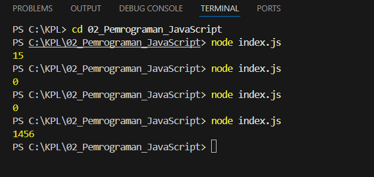

# Tugas Pendahuluan 02: Pemrograman JavaScript
**Soal**

Kamu sudah menulis fungsi mulOfArray. Ujilah dengan input [2, 0, 26, 28, -2], dengan output yang seharusnya adalah 1456. Jika kamu menemukan bahwa hasilnya berbeda, bisakah kamu memperbaikinya? Jika kamu menemukan bahwa hasilnya sama, bisakah kamu menjelaskan mengapa demikian?

**Kode sumber**

Tersedia di [index.js](./index.js)

**Output**

**Deskripsi Program**

 Pada Prrogram tersebut dirancang untuk dapat menghitung hasil perkalian dari semua bilangan positif yang terdapat didalam sebuah array dengan menggunakan struktur perulangan for dan logika pengkondisian. Melalui instruksi if (arr[i] > 0), jadi dia hanya akan mengalikan elemen yang bernilai lebih besar dari nol, sehingga angka nol yang bisa membatalkan hasil perkalian menjadi nol dan angka negatif yang bisa mengubah tanda bilangan akan otomatis diabaikan. Dengan variabel hasil pada angka 1, fungsi ini memastikan perhitungan tetap akurat, seperti pengujian input [2, 0, 26, 28, -2] yang berhasil menghasilkan output sebesar 1456.