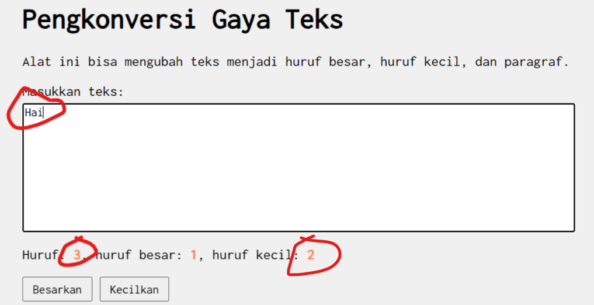
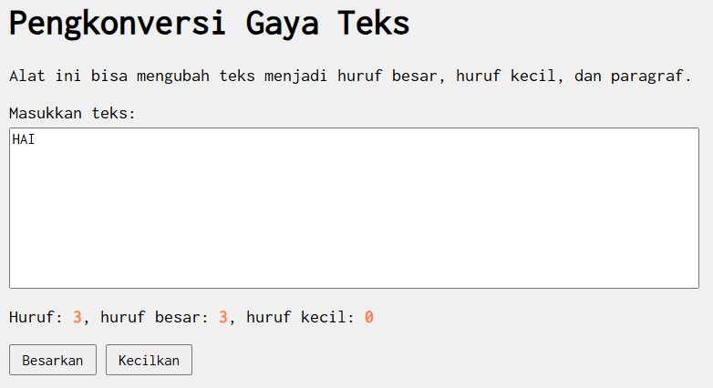
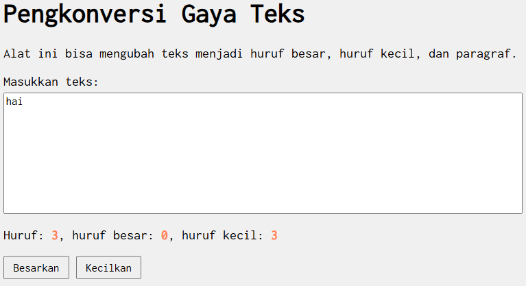
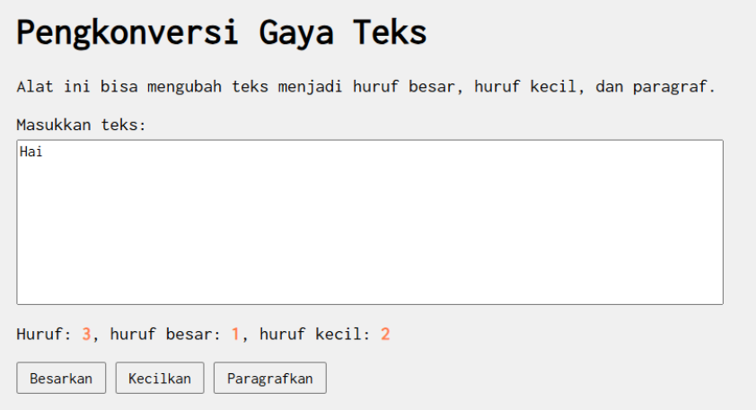
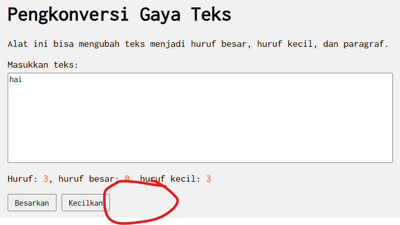

Nama: Rizqi Nawaf Putra Rosyadi

NIM: 103122430010

Kelas: SE-08-02

## Soal

Setelah kamu menyelesaikan tugas pendahuluan (bisa buka di atas), terapkanlah fungsi untuk (1) menghitung huruf kecil yang disediakan di #hk, (2) mengubah huruf kecil ke huruf besar ketika pengguna menekan tombol #huruf-besar, dan (3) mengubah huruf besar ke huruf kecil ketika pengguna menekan tombol #huruf-kecil.

Untuk nomor 2 dan 3, tampilkan hasilnya di dalam editor-kecil.

Kemudian, hapuslah fitur "Paragrafkan" dari alat.

## Program/Kode

Tersedia di 
[index.js](index.js)

[index.html](index.html)

[index.css](index.css)

## Soal 1
(1) menghitung huruf kecil yang disediakan di #hk,
    

    setelah memasukan huruf, sistem akan menampilkan jumlah huruf yang kita masukan contoh saya memasukan kata "Hai" maka jumlah huruf Kecil yang keluar berupa 2 huruf. 
    
    ```
    const hitungKecil = (teks.match(/[a-z]/g) || []).length;
    lowerCountElement.textContent = hitungKecil;
    ```

## Soal 2
(2) mengubah huruf kecil ke huruf besar ketika pengguna menekan tombol #huruf-besar,
    

    setelah memasukan huruf dan menekan tombol maka sistem akan mengubah huruf kecil menjadi huruf besar, contohnya hai menjadi HAI.

## Soal 3
(3) mengubah huruf besar ke huruf kecil ketika pengguna menekan tombol #huruf-kecil.
    

    setelah memasukan huruf besar dan menekan tombol maka sistem akan mengubah huruf besar menjadi huruf kecil, contohnya HAI menjadi hai.

## Kemudian, hapuslah fitur "Paragrafkan" dari alat.


untuk mengapus fitur paragraft saya akan menghapus beberapa code seperti berikut:

index.js
```
    document.getElementById("huruf-paragraf").addEventListener("click", () => {
         let teks = editorElement.value.toLowerCase();
            if (teks.length > 0) {
            editorElement.value = teks.charAt(0).toUpperCase() + teks.slice(1);
        }
        updateStatistik(); s
     });
```

dan menghapus pada index.html
```
 <div class="button-group">
        <button id="huruf-besar">Besarkan</button>
        <button id="huruf-kecil">Kecilkan</button>
        <!-- <button id="huruf-paragraf">Paragrafkan</button> -->
    </div>
```



