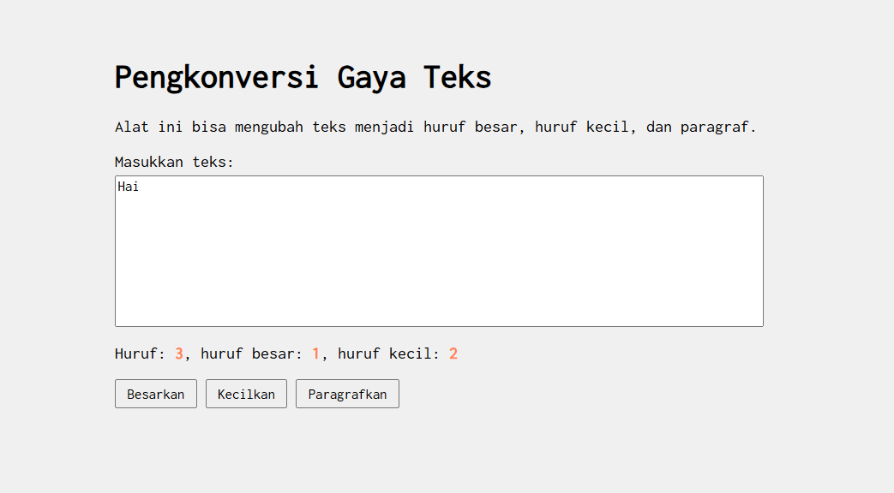

Soal

Buatlah tata letak laman yang kamu buat berada di tengah seperti di bawah ini, dan juga ubah font-nya dengan Inconsolata dari Google Fonts.

Kode sumber

Tersedia di
[index.html] (index.html)
[index.css] (index.css)

OUTPUT

Deskripsi Program

Untuk membuat tampilan berada di tengah layar seperti pada kode modul, kuncinya ada pada properti margin dan max-width di bagian body:

body {
    max-width: 600px;    
    margin: 50px auto;   
    padding: 20px;       
}

jika tanpa margin konten akan menempel di sebelah kiri. Dengan max-width, kita menentukan batas lebar, lalu auto akan membagi sisa ruang kosong di kiri dan kanan secara merata.

Untuk memastikan font Inconsolata muncul, pastikan baris ini ada di dalam <head> HTML maka saya menambahkan:
<link href="https://fonts.googleapis.com/css2?family=Inconsolata&display=swap" rel="stylesheet">
Dan di CSS gunakan:
font-family: 'Inconsolata', monospace;

