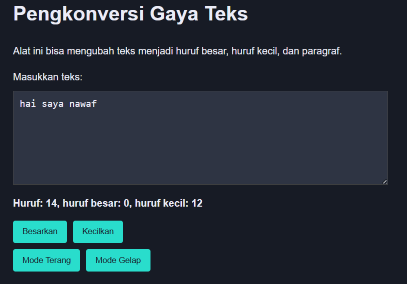
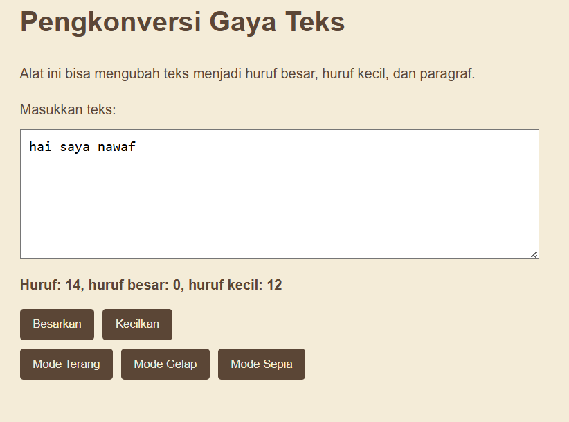

## Soal

Tambahkan mode sepia dengan ketentuan:

Elemen	Warna
Latar belakang	#F4ECD8
Warna teks	#5B4636
Biarkan form tetap warna putih.

## Kode

Tersedia di 
[index.js](index.js)

[index.html](index.html)

[style.css](style.css)

## Deskripsi
 Disini saya juga menambahkan code untuk fitur menghitung huruf, membesarkan dan mengecilkan huruf seperti TP, dan tugas ini fokus pada penambahan mode sepia

## Sebelum




## Setelah



code untuk menambahkan mode gelap dengan Ketentuan warna untuk latar belakang #F4ECD8 dan warna teks #5B4636. Teks untuk tombol tetap mengikuti warna teks sebelumnya.

```
/* modesepia */
.mode-sepia {
    background-color: #F4ECD8;
    color: #5B4636;
}

.mode-sepia button {
    background-color: #5B4636;
    color: #F4ECD8;
}

/* Biar textarea putih di mode sepia */
.mode-sepia #editor-kecil {
    background-color: #ffffff;
    color: #5B4636;
}
```