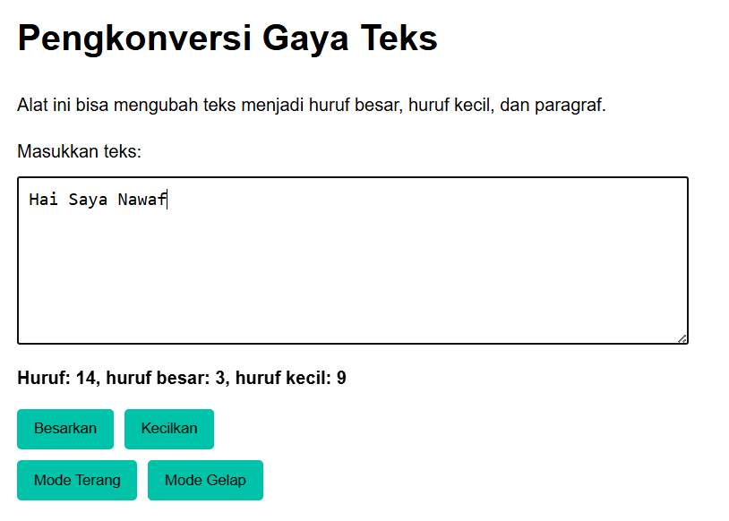

## Soal

Tambahkan mode gelap sekaligus untuk editor-kecil dan tombol-tombolnya. Ketentuan warna untuk latar belakang editor-kecil adalah #2e3443, sementara untuk tombol adalah #29ddcc. Teks untuk tombol tetap mengikuti warna teks sebelumnya.

Untuk menghapus pinggiran tombol, nyatakan properti border untuk tidak ditunjukkan.

## Kode

Tersedia di 
[index.js](index.js)

[index.html](index.html)

[style.css](style.css)

## Deskripsi
 Disini saya juga menambahkan code untuk fitur menghitung huruf, membesarkan dan mengecilkan huruf, karena dimodul sebelumnya kita sudah menghapus fitur mengparagrafkan seperti modul sebelumnya TM03

## Sebelum




## Setelah


code untuk menambahkan mode gelap dengan Ketentuan warna untuk latar belakang editor-kecil adalah #2e3443, sementara untuk tombol adalah #29ddcc. Teks untuk tombol tetap mengikuti warna teks sebelumnya.

```
.mode-gelap #editor-kecil {
    background-color: #2e3443;
    color: #ebecf7; 
    border: 1px solid #444; 
}
```

untuk tombol & hapus bordernya dengan warna #29ddcc.

```
.mode-gelap button {
    background-color: #29ddcc;
    color: #2e3443;
    border: none; 
}
```