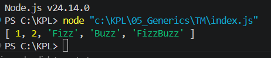

# Tugas Mandiri 05: Geerics

**Nama:** Rizqi Nawaf Putra Rosyadi

**NIM:** 103122430010

**Kelas:** SE-08-02

**Soal**

Aturan FizzBuzz kali ini adalah:

Fungsi fizzBuzz hanya menerima larik yang semua elemennya terdiri dari bilangan bulat dan mengeluarkan larik pula yang bisa jadi bercampur string dan bilangan
Fungsi zzzzOrNum hanya menerima sebuah data tunggal berupa bilangan bulat dan mengembalikan "Fizz", "FizzBuzz", "Buzz", atau bilanga bulat sesuai logikanya
Kedua fungsi harus ada dan harus disertai JSDoc sesuai tipe data yang disiratkan dari no. 1, no. 2, dan perilaku yang diharapkan di bawah
fizzBuzz harus menggunakan fungsi zzzzOrNum di dalamnya

## Program/Kode

Tersedia di 
[index.js](index.js)

**Output**



```
Hasil [ 1, 2, 'Fizz', 'Buzz', 'FizzBuzz' ] mengonfirmasi bahwa logika yang kita buat sudah tepat:
1 & 2: Tetap angka (bukan kelipatan 3 atau 5).
'Fizz': Hasil dari angka 3 (kelipatan 3).
'Buzz': Hasil dari angka 5 (kelipatan 5).
'FizzBuzz': Hasil dari angka 15 (kelipatan 3 dan 5).
```

Pertama, kita buat fungsi bernama zzzzOrNum pada file JavaScript terlebih dahulu:
```
function zzzzOrNum(value) {
    if (value % 3 === 0 && value % 5 === 0) {
        return "FizzBuzz";
    } else if (value % 3 === 0) {
        return "Fizz";
    } else if (value % 5 === 0) {
        return "Buzz";
    } else {
        return value;
    }
}
```
ini digunakan untuk mengevaluasi sebuah angka tunggal. Jika angka habis dibagi 3 dan 5 akan menghasilkan "FizzBuzz", jika hanya habis dibagi 3 menghasilkan "Fizz", jika hanya habis dibagi 5 menghasilkan "Buzz", dan jika tidak keduanya maka mengembalikan angka asli.

Lalu kita buat fungsi fizzBuzz yang akan memproses sekumpulan data:
```
function fizzBuzz(sequence) {
    const newSequence = sequence.map((e) => zzzzOrNum(e));

    return newSequence;
}
```
ini digunakan untuk menerima sebuah larik (array) berisi bilangan bulat. Fungsi ini menggunakan metode .map() untuk menjalankan fungsi zzzzOrNum pada setiap elemen di dalam larik tersebut secara otomatis.

Selanjutnya, kita ekspor kedua fungsi tersebut agar dapat digunakan di file lain:
```
module.exports = {
    fizzBuzz: fizzBuzz,
    zzzzOrNum: zzzzOrNum,
};
```
ini digunakan agar file penguji seperti test.js dapat memanggil dan menguji logika fungsi yang telah dibuat.

Terakhir, kita bisa memanggil fungsi tersebut untuk melihat hasilnya di console:
```
const data = [1, 2, 3, 5, 15];

console.log(
    fizzBuzz(data)
);
```
ini menunjukkan hasil transformasi dari input yang diberikan. Angka 3 menjadi "Fizz", angka 5 menjadi "Buzz", dan angka 15 menjadi "FizzBuzz", sedangkan angka lainnya tetap berupa angka.
