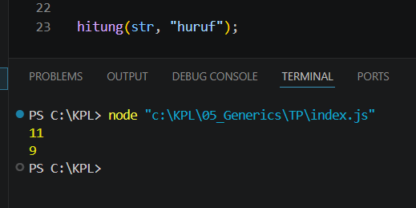

# Tugas Pendahuluan 05: Generics

**Nama:** Rizqi Nawaf Putra Rosyadi

**NIM:** 103122430010

**Kelas:** SE-08-02

**Soal**

Bagaimana caramu hanya dengan satu fungsi generik bisa mengurus keduanya?

Agar fungsi yang kamu kerjakan benar atau tidak, berikut ini adalah kode tes yang bisa kamu tempelkan:

## Program/Kode

Tersedia di 
[index.js](index.js)

**Output**


```
function hitung(teks, mode) {
    let jumlah = 0;

    for (const c of teks) {
        if (mode === "huruf" && c === ' ') {
            continue; 
        }
```

Jika mode adalah "huruf" dan karakter saat ini adalah spasi, maka abaikan karakter tersebut dan lanjut ke karakter berikutnya. 

Karakter akan dihitung di sini jika tidak terkena filter 'continue'

```
        jumlah++;
    }
    return jumlah;
}
```

PENGUJIAN
```
const str = "Bar bar bar";
```

Menghitung semua karakter termasuk spasi (Hasil: 11)
```
console.log(hitung(str, "semua")); 
```

Menghitung karakter tanpa menyertakan spasi (Hasil: 9)
```
console.log(hitung(str, "huruf")); 
```

Memanggil fungsi tanpa mencetaknya (Tidak tampil apa-apa di konsol)
```
hitung(str, "huruf");
```