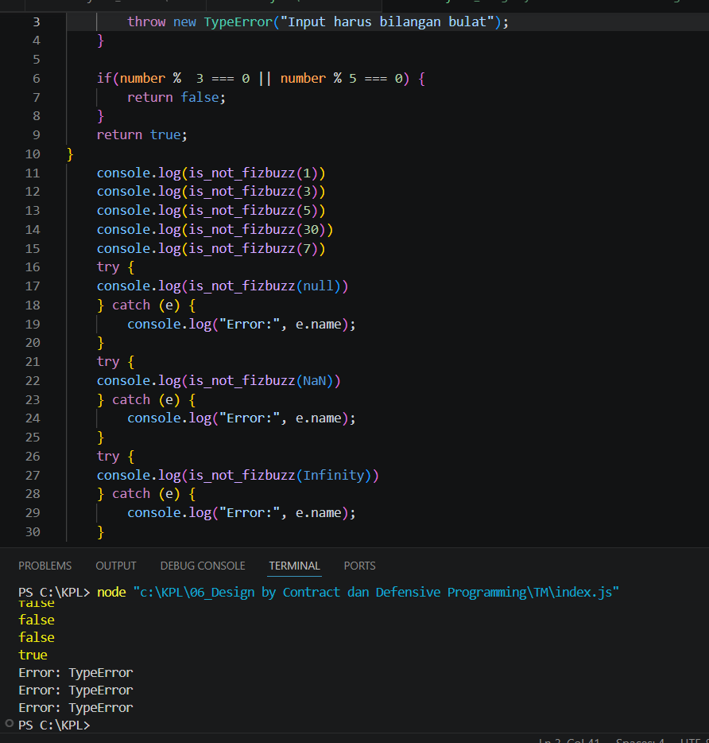

**Nama:** Rizqi Nawaf Putra Rosyadi

**NIM:** 103122430010

**Kelas:** SE-08-02

## Soal
Lindungi kode ini dari bilangan-bilangan "fizz buzz"!
<br>

Tugasmu adalah membuat fungsi yang menolak bilangan-bilangan kelipatan 3, 5, atau 15, menerima bilangan-bilangan bukan "fizz buzz", dan melempar yang bukan bilangan bulat.
```
function is_not_fizzbuzz(number) {
  // TODO
}

console.log(is_not_fizzbuzz(1)) // true
console.log(is_not_fizzbuzz(3)) // false
console.log(is_not_fizzbuzz(5)) // false
console.log(is_not_fizzbuzz(30)) // false
console.log(is_not_fizzbuzz(7)) // true
console.log(is_not_fizzbuzz(null)) // Lempar TypeError
console.log(is_not_fizzbuzz(NaN)) // Lempar TypeError
console.log(is_not_fizzbuzz(Infinity)) // Lempar TypeError
```

## Program/Kode
Program Tersedia di [index.js](index.js)

## Output


## Deskripsi
Fungsi is_not_fizzbuzz ini dirancang sebagai pnyaring bilangan bulat berdasarkan aturan Fizz Buzz dengan memastikan integritas data melalui validasi ketat menggunakan Number.isInteger(). Secara sistematis, fungsi akan melempar TypeError jika menerima input non-integer seperti null, NaN, atau Infinity, kemudian menggunakan operator modulo untuk mendeteksi kelipatan 3 atau 5; jika angka tersebut terbukti merupakan bagian dari Fizz Buzz, fungsi mengembalikan false, namun jika angka tersebut "aman" dari aturan kelipatan tersebut, fungsi akan memberikan nilai true.
