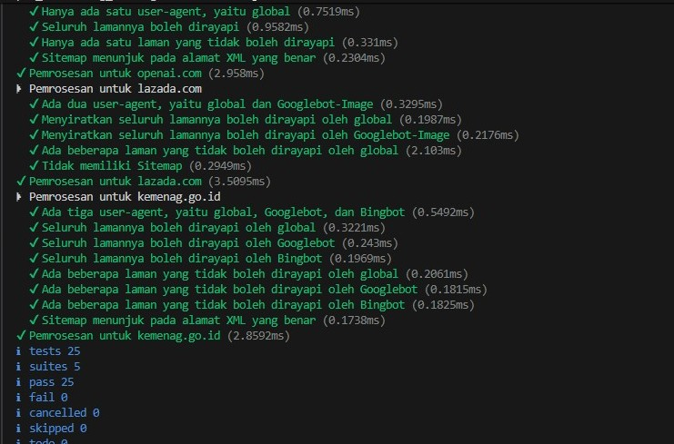

**Nama:** Rizqi Nawaf Putra Rosyadi

**NIM:** 103122430010

**Kelas:** SE-08-02

## Soal
Uraikan robot!

Tugas pada kesempatan kali ini adalah membuat fungsi yang menguraikan isi `robots.txt` menjadi POJO (_plain old JavaScript object_). Empat properti yang perlu diuraikan dijabarkan di bawah berikut.
1. `User-agent` adalah nama robot perayapnya
2. `Allow` adalah daftar halaman-halaman yang boleh dirayap
3. `Disallow` adalah daftar halaman-halaman yang tidak boleh dirayap
4. `Sitemap` adalah sebuah pranala yang menunjuk pada "denah" situs web (biasanya berformat XML)

Kamu akan mengerjakannya di dalam sebuah fungsi bernama `parseRobots` di `index.js` dan. [Buka direktori 07 di sini](https://github.com/adhiansyahancha/Praktikum-KPL/tree/242093e7173cc7885bb362e9dbe0e01b50d59bdc/07_Grammar_Based_Text_Processing) untuk mengunduh berkas yang dimaksud, berkas-berkas `robots.txt` di dalam direktori `daftar`, dan berkas pengujiannya yaitu `test.js`.

Jadi, strukturnya harus seperti ini:
```
|   index.js
|   structure.d.ts // Opsional mau ada atau tidak
|   test.js
\---daftar
        brave.txt
        kemenag.txt
        lazada.txt
        mikrotik.txt
        nikkei.txt
        openai.txt
```
Agar kode yang kamu tulis di `index.js` bekerja atau tidak, jalankan `test.js`. Jika kamu membuat proyek Node (yang ada `package.json`), pastikan untuk membuat impor menjadi CommonJS dengan `type: commonjs`.

Beberapa petunjuk:

1. Manajemen state akan membantu
2. Nilai tambah jika kamu bisa mendeskripsikannya secara code tracing
3. Tidak perlu program untuk membaca TXT, itu sudah dilakukan oleh `test.js`    
4. Hubungi asprak jika ada kendala atau kesalahan

## Program/Kode
Program Tersedia di [index.js](index.js)

## Output


## Deskripsi

Fungsi parseRobots bertugas mentransformasikan teks mentah dari dokumen robots.txt menjadi objek JavaScript terstruktur dengan membaginya ke dalam dua kategori utama, yaitu agents untuk aturan bot dan Sitemap untuk navigasi situs. Proses dimulai dengan memecah teks menjadi baris-baris individual dan menginisialisasi variabel state agenSaatIni sebagai penanda konteks bot yang sedang diproses. Saat iterasi berlangsung, setiap baris dibersihkan dari spasi berlebih; jika ditemukan kata kunci user-agent, identitas robot tersebut akan dikonversi menjadi huruf kecil dan didaftarkan ke dalam penyimpanan khusus. Selama robot tersebut aktif dalam memori state, setiap instruksi allow atau disallow yang muncul di baris berikutnya akan otomatis dikelompokkan ke dalam aturan milik robot yang bersangkutan. Sementara itu, direktif umum seperti sitemap atau host akan langsung disimpan ke ruang utama objek tanpa bergantung pada konteks robot tertentu. Setelah seluruh baris dievaluasi, fungsi mengembalikan struktur data final yang telah terorganisir secara rapi dan siap digunakan oleh sistem.