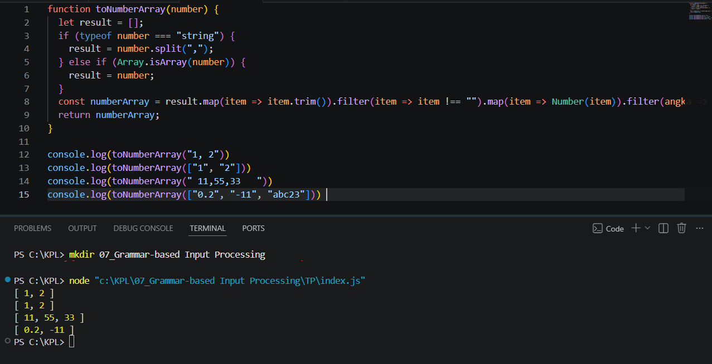

**Nama:** Rizqi Nawaf Putra Rosyadi

**NIM:** 103122430010

**Kelas:** SE-08-02

## Soal
Buatlah fungsi yang mengubah deretan angka bertipe string menjadi larik angka.
```
function toNumberArray(number) {
  // TODO
}

console.log(toNumberArray("1, 2")) // [1, 2]
console.log(toNumberArray(["1", "2"])) // [1, 2]
console.log(toNumberArray(" 11,55,33   ")) // [11, 55, 33]
console.log(toNumberArray(["0.2", "-11", "abc23"])) // [0.2, -11]
```

## Program/Kode
Program Tersedia di [index.js](index.js)

## Output


## Deskripsi
Fungsi toNumberArray bertugas untuk melakukan parsing data dengan cara membaca string yang dipisahkan oleh koma maupun sekumpulan string di dalam sebuah array, untuk kemudian diubah menjadi array baru yang hanya berisi angka murni. Secara teknis, fungsi ini mengecek tipe data input menggunakan operator typeof dan metode Array.isArray(); jika input berupa string tunggal seperti "1, 2", maka string tersebut akan dipecah menggunakan .split(",") agar menjadi bentuk array. Setelah data dipastikan berbentuk array, fungsi menggunakan .map() dengan .trim() untuk menghapus spasi berlebih di kiri dan kanan setiap elemen, serta menghapus elemen kosong (misalnya akibat dua tanda koma berurutan) melalui proses .filter(). Langkah selanjutnya adalah mengonversi tipe data dari teks menjadi angka menggunakan Number(), di mana entitas yang tidak mengandung angka valid (seperti "abc23") akan otomatis menjadi NaN. Terakhir, fungsi menggunakan .filter(angka => !Number.isNaN(angka)) untuk menyaring dan membuang semua nilai NaN tersebut sebelum mengembalikan hasil akhir berupa array angka yang bersih.