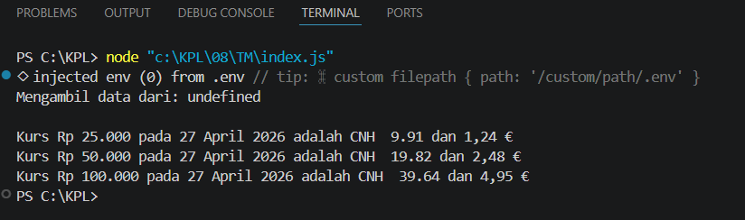

**Nama:** Rizqi Nawaf Putra Rosyadi

**NIM:** 103122430010

**Kelas:** SE-08-02

## Soal
Waktunya menukar uang!

Pada tugas ini kamu akan membuat program yang menampilkan kurs rupiah (IDR) terhadap renminbi luar Tiongkok (CNH) dan euro (EUR). Gunakan link API ini untuk mengambil data.
Tantangan:

1. Simpanlah URL API ke dalam .env sebagai BASE_API
2. Gunakan Intl untuk memformat nilai mata uang dan waktu kamu mengambil data kurs.
3. Hapus pesan promosi dotenv

## Program/Kode
Program Tersedia di [index.js](index.js)

## Output

## Deskripsi
Kode di atas mengintegrasikan konsep Runtime Configuration dan Internationalization dengan cara memuat URL API secara aman dari variabel lingkungan menggunakan pustaka dotenv melalui objek process.env.BASE_API, sementara pengolahan datanya memanfaatkan objek bawaan JavaScript Intl untuk menghasilkan output yang lokal dan profesional. Fungsi Intl.NumberFormat digunakan secara dinamis untuk mengonversi angka mentah menjadi format mata uang yang akurat sesuai standar negara masing-masing (seperti penggunaan simbol Rp, CNH, dan € beserta aturan desimalnya), dan Intl.DateTimeFormat memastikan string tanggal dari API diparsing menjadi format tanggal bahasa Indonesia yang mudah dibaca, sehingga aplikasi mampu menyajikan informasi finansial yang adaptif terhadap konteks wilayah pengguna.