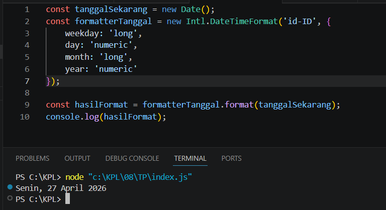

**Nama:** Rizqi Nawaf Putra Rosyadi

**NIM:** 103122430010

**Kelas:** SE-08-02

## Soal
Tampilkan tanggal sekarang dengan format seperti ini:
```
Sabtu, 18 April 2026
```
Nilai waktu tidak harus sama, asalkan formatnya benar dan bisa tampil di komputer terpisah pada waktu tertentu. Gunakan `Intl.DateTimeFormat` (bukan string manual).

## Program/Kode
Program Tersedia di [index.js](index.js)

## Output


## Deskripsi
Menggunakan objek Intl.DateTimeFormat dengan lokalitas 'id-ID' untuk memformat objek tanggal (Date) ke dalam konvensi bahasa Indonesia secara otomatis. Dengan mendefinisikan properti weekday, day, month, dan year sebagai 'long' atau 'numeric', JavaScript akan menyusun struktur penanggalan yang menyertakan nama hari dan bulan secara lengkap tanpa perlu melakukan pemetaan (mapping) string secara manual. Pendekatan ini sangat direkomendasikan karena memastikan konsistensi format di berbagai lingkungan runtime dan secara cerdas menangani aturan tata bahasa lokal yang berlaku.