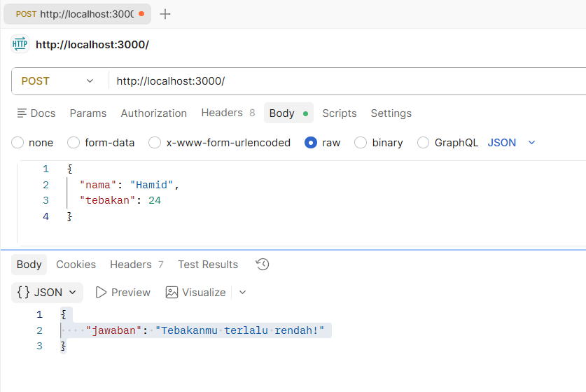

**Nama:** Rizqi Nawaf Putra Rosyadi

**NIM:** 103122430010

**Kelas:** SE-08-02

## Soal
Mari kita main tebak-tebakan angka acak!

Tugasmu adalah membuat API yang terdiri dari satu endpoint saja, yaitu POST /. 

## Program/Kode
Program Tersedia di [server.js](server.js)

## Output

## Deskripsi
Sistem API ini dirancang menggunakan Node.js dan Express untuk menjalankan permainan tebak angka deterministik di mana angka target dihasilkan melalui perhitungan nilai ASCII dari input nama pengguna, sehingga memastikan hasil yang tetap dan konsisten (stateless) tanpa memerlukan database eksternal. Berdasarkan aturan pada image_e3fa46.png, API ini hanya menyediakan satu endpoint POST yang memproses data JSON berisi nama dan angka tebakan, kemudian membandingkannya dengan angka target hasil kalkulasi pada rentang 1-100 untuk memberikan respon apakah tebakan tersebut benar, terlalu tinggi, atau terlalu rendah. Penggunaan metode hashing sederhana ini memenuhi seluruh kriteria teknis, termasuk sensitivitas terhadap huruf besar-kecil dan keharusan angka tetap sama meskipun API dipanggil berulang kali untuk nama yang sama.