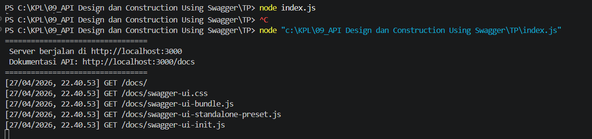
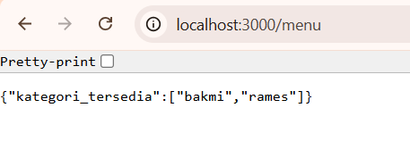
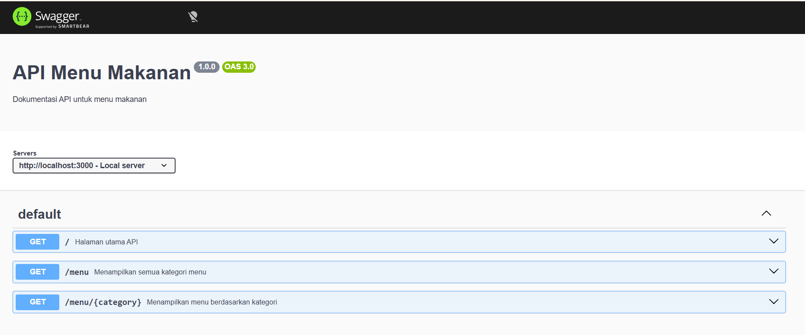
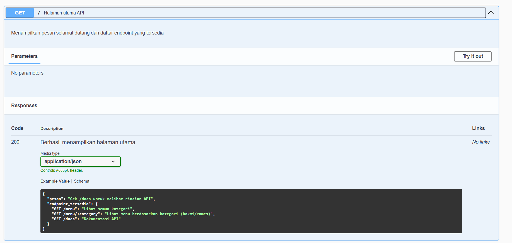
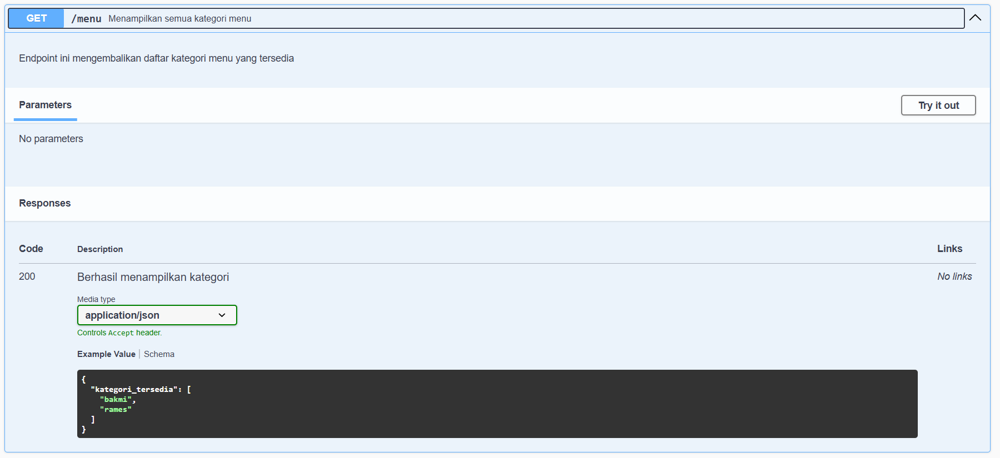
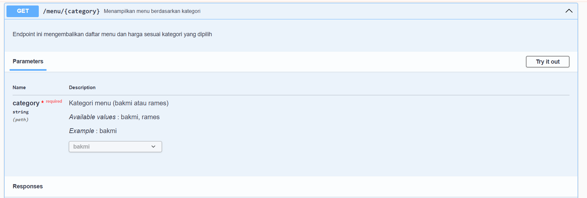
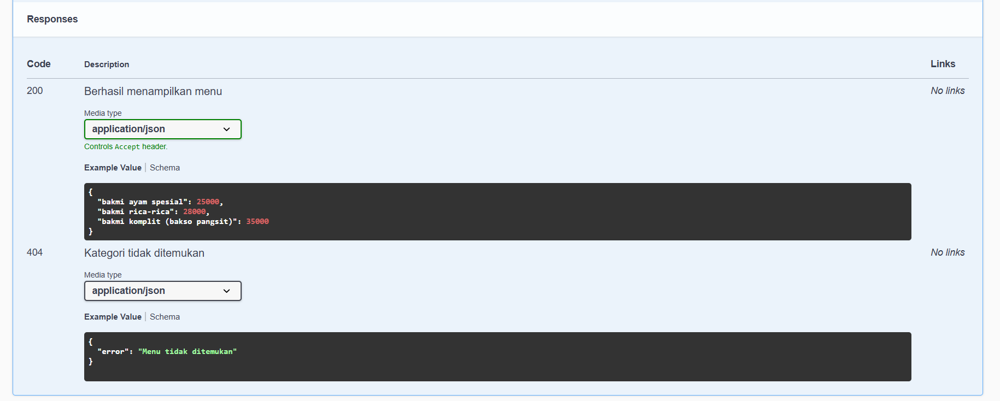

**Nama:** Rizqi Nawaf Putra Rosyadi

**NIM:** 103122430010

**Kelas:** SE-08-02

## Soal
Buatlah satu endpoint lagi beserta dokumentasi OpenAPI-nya, yaitu GET /menu yang menampilkan daftar semua nama kategori menu yang ada.

## Program/Kode
Program Tersedia di [index.js](index.js)

## Output









## Deskripsi

API (Application Programming Interface) adalah antarmuka yang memungkinkan dua perangkat lunak saling berkomunikasi dan bertukar data tanpa harus terhubung secara langsung.

API bersifat universal tidak hanya terbatas pada REST API yang biasa digunakan untuk mengambil data JSON, tetapi juga mencakup hal lain seperti Windows API yang digunakan program untuk berinteraksi dengan sistem operasi Windows.

 REST sendiri menggunakan metode HTTP seperti GET, POST, PUT, DELETE dan bersifat stateless

Middleware pada Express.js
```
// Middleware logging
app.use((req, res, next) => {
    console.log(`${req.method} ${req.url}`);
    next(); // wajib dipanggil untuk lanjut ke endpoint
});

// Middleware parsing JSON
app.use(express.json());
```
 Middleware adalah fungsi khusus yang berjalan di antara saat request masuk dari klien dan saat response dikirim dari server.
 Cara kerjanya berurutan: request masuk, kemudian melewati middleware satu per satu, lalu mencapai endpoint yang dituju, baru setelah itu response dikirim kembali.


```
p1
const swaggerDocument = {
    openapi: '3.0.0',
    paths: { ... }
};

p2
/**
 * @openapi
 * /menu:
 *   get:
 *     summary: Menampilkan semua menu
 */
```
Swagger digunakan untuk mendokumentasikan API secara otomatis dan interaktif. Ada dua pendekatan yang dapat digunakan
Pendekatan pertama adalah manual, yaitu mendefinisikan langsung object dokumentasi yang berisi seluruh spesifikasi endpoint, parameter, dan response. 
Pendekatan kedua adalah otomatis, yaitu menuliskan komentar khusus di atas setiap endpoint yang kemudian akan dibaca dan diparsing oleh Swagger menjadi dokumentasi.

Hasil Implementasi
```
// GET /menu
{
    "kategori_tersedia": ["bakmi", "rames"]
}

// GET /menu/bakmi
{
    "bakmi ayam spesial": 25000,
    "bakmi rica-rica": 28000
}
```

Dalam tugas ini, dibuat sebuah API sederhana untuk data menu makanan. Terdapat tiga endpoint yang dibuat. Endpoint pertama adalah root yang menampilkan pesan selamat datang dan daftar semua endpoint yang tersedia. Endpoint kedua menampilkan semua kategori menu yang tersedia seperti bakmi dan rames. Endpoint ketiga menampilkan daftar menu beserta harganya berdasarkan kategori yang dipilih pengguna. Selain itu, terdapat endpoint dokumentasi yang menampilkan antarmuka Swagger untuk melihat dan menguji coba seluruh API.

Dokumentasi Swagger yang dihasilkan mencakup informasi tentang server yang tersedia, daftar endpoint lengkap, parameter yang dibutuhkan untuk setiap endpoint, serta contoh response baik untuk skenario sukses maupun error.

kesimpulan 
1. API adalah jembatan komunikasi antar software
2. REST adalah arsitektur paling umum untuk web API
3. Middleware memproses request sebelum mencapai endpoint
4. Swagger mempermudah dokumentasi yang hidup dan interaktif