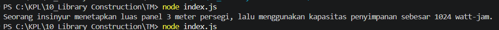

**Nama:** Rizqi Nawaf Putra Rosyadi

**NIM:** 103122430010

**Kelas:** SE-08-02

## Soal
Buatkan pustaka yang rapi!

Pada tugas ini buatlah sebuah proyek baru bernama mtk-gampang. Struktur proyeknya wajib diatur seperti di bawah ini.

|   index.js
|   package.json
\---lib
        pangkat.js
        bulat.js
        kuadrat.js
Setiap berkas lib hanya memiliki satu fungsi saja.

pangkat.js berisi fungsi pangkat(x, y) yang mengembalikan nilai akhir dari x pangkat y.
bulat.js berisi fungsi bulat(x) yang mengubah bentuk bilangan non-bulat menjadi bulat (mis. -4.25 menjadi -4) .
kuadrat.js berisi fungsi kuadrat(x) yang mengembalikan nilai akar kuadrat 2 dari x.
Satu batasannya adalah fungsi-fungsi ini harus diakses dari index.js (sebagai nilai dari properti main), bukan dari lib masing-masing.

Jika sudah selesai, buatlah proyek baru lagi dan instal pustaka yang kamu buat secara lokal. Pada index.js-nya, gunakan kode ini untuk memastikan bahwa kamu berhasil melakukannya.

import { kuadrat, pangkat, bulat } from "libr";

const narasi = `Seorang insinyur menetapkan luas panel ${bulat(kuadrat(12))} meter persegi, lalu menggunakan kapasitas penyimpanan sebesar ${pangkat(2, 10)} watt-jam. Ketika sensor mengirimkan data arus sisa yang berantakan seperti 85.95 ampere, ia kalibrasikan menjadi ${bulat(85.95)} agar sistem keamanan memutus aliran tepat pada angka bulat tanpa koma.`;

/**
 * Seorang insinyur menetapkan luas panel 3 meter persegi, lalu menggunakan kapasitas penyimpanan sebesar 1024 watt-jam. Ketika sensor mengirimkan data arus sisa yang berantakan seperti 85.95 ampere, ia kalibrasikan menjadi 85 agar sistem keamanan memutus aliran tepat pada angka bulat tanpa koma.
 * /

console.log(narasi);

## Output

## Deskripsi
Pustaka mtk-gampang adalah modul JavaScript yang saya susun menggunakan sistem ESM untuk menangani tugas matematika dasar secara rapi dan terstruktur. Saya memisahkan setiap fungsi ke dalam folder lib/ agar lebih mudah dikelola, mencakup fungsi untuk menghitung pangkat, akar kuadrat, dan pembulatan angka. Melalui file utama index.js dan pengaturan package.json yang tepat, semua fungsi ini bisa dipanggil sekaligus, sehingga kode jadi lebih modular, bersih, dan siap digunakan untuk kebutuhan proyek lain.