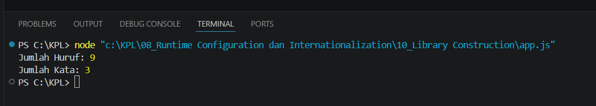

**Nama:** Rizqi Nawaf Putra Rosyadi

**NIM:** 103122430010

**Kelas:** SE-08-02

## Soal
Buatlah pustaka JavaScript yang menyediakan utilitas berupa dua fungsi yang menghitung jumlah huruf dan jumlah kata.

Kriteria:

Hanya alfabet A hingga Z yang dihitung (besar dan kecil)
Spasi tidak dihitung
Pustaka bisa diimpor

## Program/Kode
Program Tersedia di [index.js](index.js)

## Output

## Deskripsi
Kode tersebut merupakan implementasi praktis dari materi Library Construction, di mana fungsi utilitas dibungkus dalam modul index.js menggunakan kata kunci export agar bisa digunakan secara modular di berkas lain. Fungsi hitungHuruf bekerja dengan memanfaatkan Regular Expression (/[^a-zA-Z]/g) untuk menyaring karakter sehingga hanya alfabet yang tersisa, sementara fungsi hitungKata menggunakan metode .trim() dan .split() untuk memecah kalimat menjadi array berdasarkan spasi. Dengan menambahkan "type": "module" pada package.json, Node.js akan mengenali sintaks import/export (ESM) tersebut, yang memungkinkan pemanggilan fungsi secara spesifik dan efisien sebagaimana dicontohkan pada pengujian variabel input yang menghasilkan output jumlah huruf dan kata yang akurat.