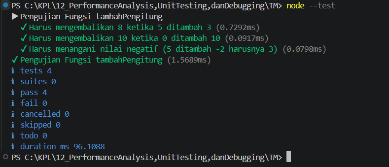

**Nama:** Rizqi Nawaf Putra Rosyadi

**NIM:** 103122430010

**Kelas:** SE-08-02

## Soal
Tambah dan tambah!

Fungsi di bawah ini melakukan penjumlaha pada penghitung (counter), yang sesederhana menambahk jumlah jika kamu menekan tombol.

hitung.js
```
function tambahPengitung(terkini, jumlah) {
  terkini = terkini + jumlah;
  return terkini;
}
hitung.test.js

import { test } from 'node:test';
import assert from 'node:assert';
import { tambahPengitung } from './hitung.js';

test('5 tambah 3 sama dengan 8', () => {
  assert.strictEqual(tambahPengitung(5, 3), 8);
});

test('0 tambah 10 sama dengan 10', () => {
  assert.strictEqual(tambahPengitung(0, 10), 10);
});
```
Bisakah kamu tunjukkan apakah kode sudah benar atau bagian mana yang perlu diperbaiki beserta alasannya?


## Program/Kode
Program Tersedia di [index.js](index.js)

## Output


## Deskripsi
Secara fungsional, Kode asli pada berkas hitung.js dan hitung.test.js sudah berfungsi dengan benar. semua pengujian akan lolos

Meskipun lolos uji, ada dua hal pada berkas hitung.js yang kurang efisien dan tidak memenuhi standar clean code:

Masalah: Reassignment Parameter (terkini = terkini + jumlah)

Alasan: Mengubah nilai variabel parameter fungsi secara langsung (mutating/reassigning parameters) adalah praktik buruk (bad practice). Hal ini bisa memicu efek samping (side effects) yang tidak terduga dan membuat kode sulit dibaca saat program berkembang.

Masalah: Kode Terlalu Bertele-tele

Alasan: Operasi penjumlahan sederhana tidak perlu ditampung ulang ke variabel lama lalu baru di-return. Kita bisa langsung mengembalikan hasil penjumlahannya.

Solusi Perbaikan (Kode yang Lebih Bersih)
Fungsi diubah agar langsung mengembalikan nilai penjumlahan (return terkini + jumlah) tanpa mengubah variabel aslinya:
JavaScript
```
///hitung.js yang sudah diperbaiki
export function tambahPengitung(terkini, jumlah) {
  return terkini + jumlah; 
}
```

Kesimpulan: Perbaikan ini membuat fungsi bersifat pure (tidak mengubah data input), lebih aman dari bug, serta lebih mudah dirawat kedepannya.
