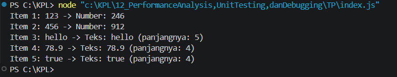

**Nama:** Rizqi Nawaf Putra Rosyadi

**NIM:** 103122430010

**Kelas:** SE-08-02

## Soal
Cobalah untuk menangkap kecacatan dalam kode ini

```
function main() {
  const data = [
    "123",
    456,
    "hello",
    78.9,
    true,
  ];

  for (let i = 0; i < data.length; i++) {
    const result = processData(data[i]);
    console.log(`Item ${i + 1}: ${data[i]} -> ${result}`);
  }
}

function processData(data) {
  const str = data.toLowerCase();
  const num = parseInt(str);
  if (!isNaN(num) && str === String(num)) {
    return `Number: ${num * 2}`;
  }
  return `Teks: ${str} (panjangnya: ${str.length})`;
}

main();
```

## Program/Kode
Program Tersedia di [index.js](index.js)

## Output


## Deskripsi
TypeError: data.toLowerCase is not defined pada iterasi kedua perulangan, di mana fungsi processData() menerima input berupa angka (456) dan secara paksa memanggil metode .toLowerCase() yang sebetulnya hanya tersedia khusus untuk tipe data String. Kasus ini merupakan contoh nyata pentingnya debugging dan penanganan edge cases pada data heterogen, karena program langsung mati total sebelum sempat mengeksekusi sisa data berikutnya ("hello", 78.9, true). Solusinya adalah dengan menerapkan defensive programming melalui konversi tipe data secara eksplisit menggunakan String(data).toLowerCase(), sehingga semua variasi data input dijamin aman diubah menjadi teks terlebih dahulu sebelum dimanipulasi, dan program dapat berjalan tuntas hingga menghasilkan keluaran yang valid.